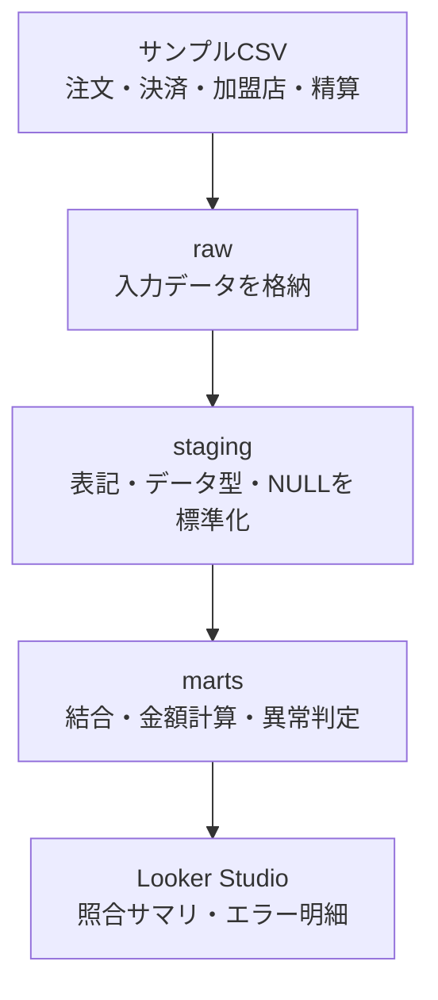

# payment-reconciliation-data-mart

注文・決済・加盟店・精算データを注文単位で照合し、不一致の有無と理由を確認するデータマートです。

BigQueryとdbtを使って、サンプルデータを投入・整形・照合し、照合結果とエラー明細をLooker Studioで可視化します。変更時には、GitHub Actions上でdbt testを実行し、データ構造と期待結果を自動検証します。

## 想定シナリオ

### 業務背景

決済・精算の運用担当者が、注文から決済・精算まで正しく処理されているかを確認する業務を想定しています。

### 業務課題

注文・決済・加盟店・精算のデータが別々に管理されている場合、複数のデータを横断して照合する必要があります。人手や個別のSQLによる照合では、データの欠損や金額の不一致を見落としやすく、異常が発生した取引の特定や原因調査にも時間がかかります。

### 解決方法

各データをBigQuery上で統合し、dbtとSQLを用いて注文単位で照合するデータマートを構築しました。12種類の不整合を判定し、注文単位の照合結果とエラー種別ごとの明細を生成することで、異常の把握から対象取引の原因調査まで行えるようにしています。

## 概要データフロー

この図はデータの流れだけを示しています。GitHub Actions、dbt test、dbt Docsを含む詳細構成は[実装設計](docs/implementation-design.md#2-システム構成)を参照してください。

## 主な機能

- 注文を母集団として、決済・加盟店・精算データを照合
- 「データ欠損」「処理状態異常」「データ不一致」「日時不正」の4分類、計12種類の異常を判定
- 1注文1行の照合結果と、1注文・1エラー種別につき1行のエラー明細を作成
- GitHub Actions上でdbt testを実行し、期待結果とデータ品質を自動検証
- Looker Studioで照合サマリとエラー明細を可視化

12種類の正式な定義と判定条件は[照合・異常判定要件](docs/requirements-and-acceptance.md#7-照合異常判定要件)に集約しています。

## 可視化

### 照合サマリ

注文全体の照合状況と、4分類・12種類のエラー発生件数を表示します。

[Looker Studio用エラー種別サマリクエリ](payment_reconciliation/analyses/looker_studio_error_type_summary.sql)：4分類・12種類の表示順と、0件を含む集計ロジックを定義

### エラー明細

異常が検出された注文について、注文・決済・精算の識別情報、エラー理由、照合対象の金額、精算状態、注文・決済・精算日時を一覧表示します。

[Looker Studio用エラー明細クエリ](payment_reconciliation/analyses/looker_studio_reconciliation_error_details.sql)：エラー明細と注文単位の照合結果を結合し、原因調査に使用する17項目を出力

ダッシュボードは照合結果を確認するための参照用であり、データの更新や業務処理を行う機能は持ちません。

## ドキュメント

- [要件・受入基準](docs/requirements-and-acceptance.md)：対象範囲、業務要件、エラー定義、受入基準
- [実装設計](docs/implementation-design.md)：システム構成、入力データの論理ER図、データ処理、結合方式、テスト、CI・ドキュメント公開方式
- [dbt Docs](https://naohide-sugita.github.io/payment-reconciliation-data-mart/)：モデル間の依存関係、テーブル・カラム仕様、テスト情報。テーブルごとの詳細は下記の[テーブル一覧](#テーブル一覧)を参照

### テーブル一覧

| レイヤー | テーブル・モデル名 | 役割 | 詳細仕様 |
|---|---|---|---|
| raw | `merchants` | 加盟店のサンプルデータ | [dbt Docs](https://naohide-sugita.github.io/payment-reconciliation-data-mart/#!/source/source.payment_reconciliation.raw.merchants) |
| raw | `orders` | 注文のサンプルデータ | [dbt Docs](https://naohide-sugita.github.io/payment-reconciliation-data-mart/#!/source/source.payment_reconciliation.raw.orders) |
| raw | `payments` | 決済のサンプルデータ | [dbt Docs](https://naohide-sugita.github.io/payment-reconciliation-data-mart/#!/source/source.payment_reconciliation.raw.payments) |
| raw | `settlements` | 精算のサンプルデータ | [dbt Docs](https://naohide-sugita.github.io/payment-reconciliation-data-mart/#!/source/source.payment_reconciliation.raw.settlements) |
| staging | `stg_merchants` | 加盟店データの文字列と手数料率を標準化 | [dbt Docs](https://naohide-sugita.github.io/payment-reconciliation-data-mart/#!/model/model.payment_reconciliation.stg_merchants) |
| staging | `stg_orders` | 注文データの文字列、金額、日時を標準化 | [dbt Docs](https://naohide-sugita.github.io/payment-reconciliation-data-mart/#!/model/model.payment_reconciliation.stg_orders) |
| staging | `stg_payments` | 決済データの文字列、状態、金額、日時、空文字を標準化 | [dbt Docs](https://naohide-sugita.github.io/payment-reconciliation-data-mart/#!/model/model.payment_reconciliation.stg_payments) |
| staging | `stg_settlements` | 精算データの文字列、状態、金額、日時を標準化 | [dbt Docs](https://naohide-sugita.github.io/payment-reconciliation-data-mart/#!/model/model.payment_reconciliation.stg_settlements) |
| marts | `fct_payment_reconciliation` | 1注文1行の照合結果 | [dbt Docs](https://naohide-sugita.github.io/payment-reconciliation-data-mart/#!/model/model.payment_reconciliation.fct_payment_reconciliation) |
| marts | `fct_reconciliation_errors` | 1注文・1エラー種別につき1行の明細 | [dbt Docs](https://naohide-sugita.github.io/payment-reconciliation-data-mart/#!/model/model.payment_reconciliation.fct_reconciliation_errors) |

## 実行・検証

`main`へのpushまたはpull request時に、GitHub Actionsがサンプルデータの投入、モデル作成、テスト、dbt Docs生成を自動実行します。

自分のPCからBigQueryへ接続して同じ処理を再現する場合の前提条件、コマンド、各処理の内容は[実装設計の「実行と継続的検証」](docs/implementation-design.md#8-実行と継続的検証)を参照してください。

## 使用技術

BigQuery、dbt Core、dbt-bigquery、SQL、YAML、GitHub Actions、GitHub Pages、Looker Studio、Git / GitHubを使用しています。

対象範囲と対象外は[要件・受入基準](docs/requirements-and-acceptance.md#3-対象範囲)を参照してください。
