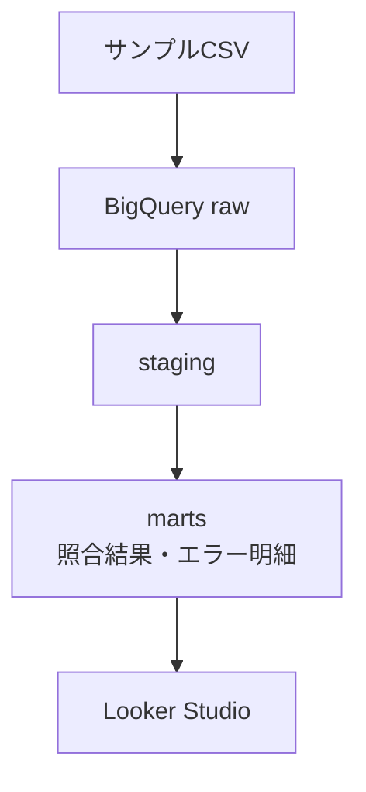

# payment-reconciliation-data-mart

注文・決済・加盟店・精算データを注文単位で照合し、不一致の有無と理由を確認するデータマートです。

BigQueryとdbtを使って、動作確認用のサンプルデータを投入・整形・照合し、品質テストを行った結果をLooker Studioで可視化します。

## 概要データフロー

この図はデータの流れだけを示しています。GitHub Actions、dbt test、dbt Docsを含む詳細構成は[実装設計](docs/implementation-design.md#2-システム構成)を参照してください。

## 主な機能

- 注文を母集団として、決済・加盟店・精算データを照合
- 「データ欠損」「処理状態異常」「データ不一致」「日時不正」の4分類、計12種類の異常を判定
- 1注文1行の照合結果と、1注文・1エラー種別につき1行のエラー明細を作成
- dbt testとGitHub Actionsで期待結果およびデータ品質を検証
- Looker Studioで照合サマリとエラー明細を可視化

12種類の正式な定義と判定条件は[照合・異常判定要件](docs/requirements-and-acceptance.md#6-照合異常判定要件)に集約しています。

## 可視化

### 照合サマリ

注文全体の照合状況と、4分類・12種類のエラー発生件数を表示します。

※エーラ内訳件数（[クエリ](payment_reconciliation/analyses/looker_studio_error_type_summary.sql)）：4分類、表示順、0件を含む集計ロジック

### エラー明細

異常が検出された注文について、注文ID、エラーコード、エラー内容を一覧表示します。

> [!NOTE]
> ダッシュボードは照合結果を確認するための参照用であり、データの更新や業務処理を行う機能は持ちません。

## ドキュメント

- [要件・受入基準](docs/requirements-and-acceptance.md)：対象範囲、業務要件、エラー定義、受入基準
- [実装設計](docs/implementation-design.md)：システム構成、データ処理、結合方式、テスト、CI・ドキュメント公開方式
- [dbt Docs](https://naohide-sugita.github.io/payment-reconciliation-data-mart/)：モデル間の依存関係、テーブル・カラム仕様、テスト情報。※下記のテーブル一覧を参照

### テーブル一覧

| レイヤー | テーブル・モデル名 | 役割 | 詳細仕様 |
|---|---|---|---|
| raw | `merchants` | 加盟店のサンプルデータ | [dbt Docs](https://naohide-sugita.github.io/payment-reconciliation-data-mart/#!/source/source.payment_reconciliation.raw.merchants) |
| raw | `orders` | 注文のサンプルデータ | [dbt Docs](https://naohide-sugita.github.io/payment-reconciliation-data-mart/#!/source/source.payment_reconciliation.raw.orders) |
| raw | `payments` | 決済のサンプルデータ | [dbt Docs](https://naohide-sugita.github.io/payment-reconciliation-data-mart/#!/source/source.payment_reconciliation.raw.payments) |
| raw | `settlements` | 精算のサンプルデータ | [dbt Docs](https://naohide-sugita.github.io/payment-reconciliation-data-mart/#!/source/source.payment_reconciliation.raw.settlements) |
| staging | `stg_merchants` | 加盟店データの型・名称を統一 | [dbt Docs](https://naohide-sugita.github.io/payment-reconciliation-data-mart/#!/model/model.payment_reconciliation.stg_merchants) |
| staging | `stg_orders` | 注文データの型・名称を統一 | [dbt Docs](https://naohide-sugita.github.io/payment-reconciliation-data-mart/#!/model/model.payment_reconciliation.stg_orders) |
| staging | `stg_payments` | 決済データの型・名称を統一 | [dbt Docs](https://naohide-sugita.github.io/payment-reconciliation-data-mart/#!/model/model.payment_reconciliation.stg_payments) |
| staging | `stg_settlements` | 精算データの型・名称を統一 | [dbt Docs](https://naohide-sugita.github.io/payment-reconciliation-data-mart/#!/model/model.payment_reconciliation.stg_settlements) |
| marts | `fct_payment_reconciliation` | 1注文1行の照合結果 | [dbt Docs](https://naohide-sugita.github.io/payment-reconciliation-data-mart/#!/model/model.payment_reconciliation.fct_payment_reconciliation) |
| marts | `fct_reconciliation_errors` | 1注文・1エラー種別につき1行の明細 | [dbt Docs](https://naohide-sugita.github.io/payment-reconciliation-data-mart/#!/model/model.payment_reconciliation.fct_reconciliation_errors) |

## 実行・検証

`main`へのpushまたはpull request時に、GitHub Actionsがサンプルデータの投入、モデル作成、テスト、dbt Docs生成を自動実行します。

自分のPCからBigQueryへ接続して同じ処理を再現する場合の前提条件、コマンド、各処理の内容は[実装設計の「実行と継続的検証」](docs/implementation-design.md#8-実行と継続的検証)を参照してください。

## 使用技術

BigQuery、dbt Core、dbt-bigquery、SQL、YAML、GitHub Actions、GitHub Pages、Looker Studio、Git / GitHubを使用しています。

対象範囲と対象外は[要件・受入基準](docs/requirements-and-acceptance.md#3-対象範囲)を参照してください。
