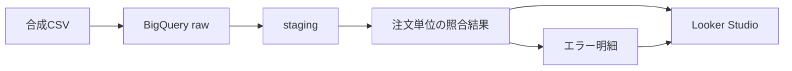
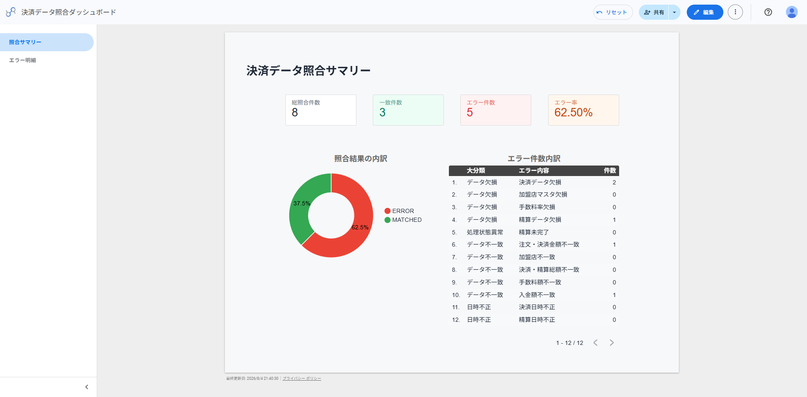
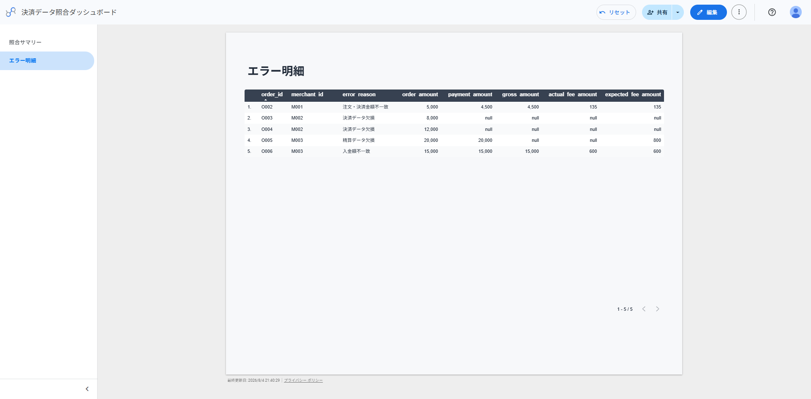

# payment-reconciliation-data-mart

注文・決済・加盟店・精算データを照合し、不一致のある取引とその理由を確認するデータマートです。

BigQueryとdbtを使用して、合成データの投入、整形、照合、品質テストを行い、照合結果をLooker Studioで可視化します。

## プロジェクトの目的

決済業務では、注文・決済・精算データが別々に管理されるため、次のような不一致が発生する可能性があります。

- 注文に対応する決済が存在しない
- 決済に対応する精算が存在しない
- 注文金額と決済金額が一致しない
- 決済金額と精算金額が一致しない
- 加盟店や手数料の情報に不備がある
- 決済・精算の状態や日時に矛盾がある

本プロジェクトでは、これらのデータを注文単位で照合し、正常・異常の判定と異常理由を確認できるデータマートを構築します。

## 全体構成



処理の流れは以下のとおりです。

1. 合成CSVを`dbt seed`でBigQueryへ投入する
2. stagingモデルで項目名とデータ型を整える
3. 注文を基準に決済・加盟店・精算データを結合する
4. 注文単位で12種類の異常を判定する
5. 異常フラグをエラー種別ごとの明細へ変換する
6. Looker Studioで照合サマリとエラー明細を可視化する
7. dbt testとGitHub Actionsで処理結果を検証する

## 使用技術

| 技術 | 用途 |
|---|---|
| BigQuery | raw、staging、martsデータの保持 |
| dbt Core | データ投入、変換、テスト |
| dbt-bigquery | dbtからBigQueryへの接続 |
| SQL | データ整形、照合、異常判定 |
| YAML | モデル定義、カラム説明、テスト定義 |
| GitHub Actions | dbt処理の自動検証 |
| Looker Studio | 照合結果の可視化 |
| Git / GitHub | ソースコード管理 |

## データモデル

| レイヤー | モデル | 種別 | 役割 |
|---|---|---|---|
| raw | `merchants` | テーブル | 加盟店データ |
| raw | `orders` | テーブル | 注文データ |
| raw | `payments` | テーブル | 決済データ |
| raw | `settlements` | テーブル | 精算データ |
| staging | `stg_merchants` | ビュー | 加盟店データの整形 |
| staging | `stg_orders` | ビュー | 注文データの整形 |
| staging | `stg_payments` | ビュー | 決済データの整形 |
| staging | `stg_settlements` | ビュー | 精算データの整形 |
| marts | `fct_payment_reconciliation` | ビュー | 1注文1行の照合結果 |
| marts | `fct_reconciliation_errors` | ビュー | 1注文・1エラー種別につき1行のエラー明細 |

各テーブルおよびカラムの詳細は、[テーブル・カラム仕様](#テーブルカラム仕様)を参照してください。

## 照合ロジック

注文を基準に、成功した決済、加盟店マスタ、精算データを結合します。

関連するデータが存在しない注文も照合対象に残し、データ欠落を異常として検出します。

注文単位で、以下の12種類の異常を判定します。

| エラーコード | 判定内容 |
|---|---|
| `PAYMENT_MISSING` | 成功した決済がない |
| `MERCHANT_MISSING` | 加盟店マスタがない |
| `FEE_RATE_MISSING` | 手数料率が設定されていない |
| `ORDER_PAYMENT_AMOUNT_MISMATCH` | 注文金額と決済金額が一致しない |
| `SETTLEMENT_MISSING` | 精算データがない |
| `SETTLEMENT_NOT_COMPLETED` | 精算が完了していない |
| `MERCHANT_MISMATCH` | 注文と精算の加盟店が一致しない |
| `GROSS_AMOUNT_MISMATCH` | 決済金額と精算総額が一致しない |
| `FEE_AMOUNT_MISMATCH` | 実際の手数料と計算上の手数料が一致しない |
| `NET_AMOUNT_MISMATCH` | 実際の入金額と計算上の入金額が一致しない |
| `PAYMENT_DATETIME_INVALID` | 決済日時が不正 |
| `SETTLEMENT_DATETIME_INVALID` | 精算日時が不正 |

1つの注文に複数の異常がある場合は、すべての異常を保持します。

異常フラグの合計を`error_count`として保持し、判定結果を次のように設定します。

- `error_count = 0`：`MATCHED`
- `error_count >= 1`：`ERROR`

## エラー明細

`fct_reconciliation_errors`では、注文単位の異常フラグをエラー種別ごとの行へ変換します。

主な項目は以下のとおりです。

| 項目 | 内容 |
|---|---|
| `order_id` | 異常が発生した注文ID |
| `error_code` | エラーの種類 |
| `error_reason` | エラー内容の説明 |

正常な注文はエラー明細へ出力しません。

複数の異常がある注文は、エラー種別ごとに複数行として出力します。

## テスト

dbt testでは、主に以下を確認します。

- 主キーにNULLや重複がないこと
- 必須項目がNULLでないこと
- ステータスが定義した値に含まれること
- モデル間の参照関係が正しいこと
- 注文単位の照合結果が1注文1行であること
- 12種類の異常フラグがNULLでないこと
- `error_count`が異常フラグの合計と一致すること
- `reconciliation_status`が`error_count`と一致すること
- 合成データの期待結果と実際の照合結果が一致すること
- エラー明細が注文単位の異常フラグと対応すること
- `error_code`が定義した12種類のいずれかであること

合成データには意図的な異常を含めています。

そのため、異常が検出されたこと自体ではなく、定義した期待結果どおりに判定されたかをテストします。

## 可視化

Looker Studioでは、照合結果を次の2ページで確認できます。

### 照合サマリ

注文全体の照合状況と、エラー種別ごとの発生件数を表示します。



### エラー明細

異常が検出された注文について、注文ID、エラーコード、エラー内容を一覧表示します。



ダッシュボードは照合結果を確認するための参照用であり、データの更新や業務処理を行う機能は持ちません。

## GitHub Actions

dbt関連ファイルが変更された場合、GitHub Actionsで以下の処理を実行します。

```text
dbt debug
    ↓
dbt seed --full-refresh
    ↓
dbt run --full-refresh
    ↓
dbt test
```

いずれかの処理が失敗した場合は、ワークフロー全体を失敗とします。

## ディレクトリ構成

```text
payment-reconciliation-data-mart/
├── .github/
│   └── workflows/
├── docs/
│   ├── images/
│   │   ├── looker-studio-dashboard_01.png
│   │   └── looker-studio-dashboard_02.png
│   ├── implementation-design.md
│   └── requirements-and-acceptance.md
├── README.md
└── payment_reconciliation/
    ├── dbt_project.yml
    ├── models/
    │   ├── staging/
    │   │   ├── schema.yml
    │   │   └── sources.yml
    │   └── marts/
    │       └── schema.yml
    ├── seeds/
    ├── tests/
    └── scripts/
```

## 実行方法

dbtプロジェクトのディレクトリへ移動します。

```powershell
cd payment_reconciliation
```

BigQueryとの接続を確認します。

```powershell
dbt debug
```

合成CSVをBigQueryへ投入します。

```powershell
dbt seed --full-refresh
```

各モデルを作成します。

```powershell
dbt run --full-refresh
```

データ品質テストを実行します。

```powershell
dbt test
```

## 設計資料

- [要件・受入基準](docs/requirements-and-acceptance.md)
- [実装設計](docs/implementation-design.md)

### テーブル・カラム仕様

- [rawデータ定義](payment_reconciliation/models/staging/sources.yml)
- [stagingモデル定義](payment_reconciliation/models/staging/schema.yml)
- [martsモデル定義](payment_reconciliation/models/marts/schema.yml)

各YAMLには、モデルとカラムの説明、および関連するdbtテストを記載しています。

## 対象外

本プロジェクトでは、以下を対象外としています。

- APIやGCSからの継続的なデータ取込
- 日次スケジュール実行
- 増分更新
- 取込履歴やバッチ監視
- 障害通知や自動復旧
- 注文に紐づかない決済・精算の検出
- 本番規模の性能・可用性設計
- 実在する企業、顧客、取引のデータ利用