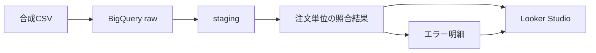

# payment-reconciliation-data-mart

注文・決済・加盟店・精算データを注文単位で照合し、不一致の有無と理由を確認するデータマートです。

BigQueryとdbtを使って合成データの投入、整形、照合、品質テストを行い、結果をLooker Studioで可視化します。

## 概要データフロー



この図はデータの流れだけを示しています。GitHub Actions、dbt test、dbt Docsを含む詳細構成は[実装設計](docs/implementation-design.md#2-システム構成)を参照してください。

## 主な機能

- 注文を母集団として、決済・加盟店・精算データを照合
- 「データ欠損」「処理状態異常」「データ不一致」「日時不正」の4分類、計12種類の異常を判定
- 1注文1行の照合結果と、1注文・1エラー種別につき1行のエラー明細を作成
- dbt testとGitHub Actionsで期待結果およびデータ品質を検証
- Looker Studioで照合サマリとエラー明細を可視化

12種類の正式な定義と判定条件は[照合・異常判定要件](docs/requirements-and-acceptance.md#6-照合異常判定要件)に集約しています。

## 可視化

### 照合サマリ

注文全体の照合状況と、4分類・12種類のエラー発生件数を表示します。


### エラー明細

異常が検出された注文について、注文ID、エラーコード、エラー内容を一覧表示します。


ダッシュボードは照合結果を確認するための参照用であり、データの更新や業務処理を行う機能は持ちません。照合サマリには[Looker Studio用エラー種別サマリクエリ](payment_reconciliation/analyses/looker_studio_error_type_summary.sql)を使用しています。

## ドキュメント

- [要件・受入基準](docs/requirements-and-acceptance.md)：対象範囲、業務要件、エラー定義、受入基準
- [実装設計](docs/implementation-design.md)：処理方式、データモデル、テスト、CI・ドキュメント公開方式
- [dbt Docs（テーブル・カラム仕様）](https://naohide-sugita.github.io/payment-reconciliation-data-mart/)：モデル依存関係、カラム説明、データ型、dbtテスト
- [Looker Studio用エラー種別サマリクエリ](payment_reconciliation/analyses/looker_studio_error_type_summary.sql)：4分類、表示順、0件を含む集計ロジック

テーブル・カラム仕様の正本はdbt Docsです。定義元のYAMLは[staging](payment_reconciliation/models/staging/schema.yml)、[sources](payment_reconciliation/models/staging/sources.yml)、[marts](payment_reconciliation/models/marts/schema.yml)にあります。

## ローカル実行

```powershell
cd payment_reconciliation
dbt debug
dbt seed --full-refresh
dbt run --full-refresh
dbt test
dbt docs generate
dbt docs serve
```

接続設定と実行・公開フローの詳細は[実装設計](docs/implementation-design.md#8-実行と継続的検証)を参照してください。

## 使用技術

BigQuery、dbt Core、dbt-bigquery、SQL、YAML、GitHub Actions、GitHub Pages、Looker Studio、Git / GitHubを使用しています。

対象範囲と対象外は[要件・受入基準](docs/requirements-and-acceptance.md#3-対象範囲)を参照してください。
