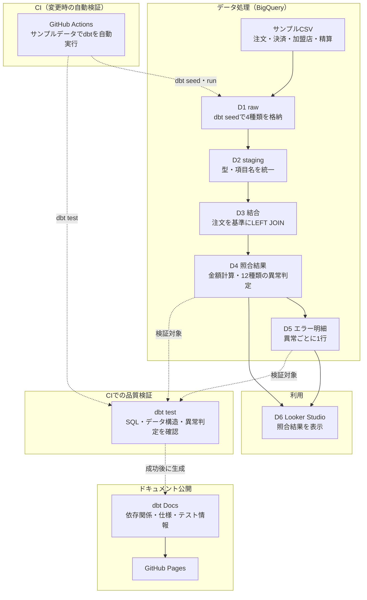

# 実装設計

関連資料：[要件・受入基準](requirements-and-acceptance.md)

## 1. 目的

本書は、以下の実装方式を示すことを目的とする。

- サンプルCSVから照合結果とエラー明細を作成し、Looker Studioで可視化する方式
- GitHubへの変更反映時に、SQL・データ構造・異常判定を自動検証するCIの方式
- データモデルの依存関係、テーブル・カラム仕様、テスト定義をdbt Docsで生成・公開する方式

業務要件、12種類のエラー判定条件、受入基準の詳細は[要件・受入基準](requirements-and-acceptance.md)を正本とする。本書では、それらを実現するためのデータ処理・テスト・可視化の実装方式を示す。

## 2. システム構成



実線はデータの流れ、点線はGitHub Actionsによる実行・検証・公開の制御を表す。異常が0件の注文は`MATCHED`、1件以上の注文は`ERROR`とし、検出した異常ごとにエラー明細を出力する。業務上の異常は照合結果であり、ワークフローの失敗とは扱わない。dbt testでデータ構造や期待結果の不一致を検出した場合はGitHub Actionsを失敗として終了し、後続のdbt Docs生成・公開を行わない。

> [!NOTE]
> 本図の品質検証は、本番データを継続的に監視する機能ではない。GitHubへ変更を反映した際に、サンプルデータを使ってSQLや異常判定が意図どおり動作するかを確認するCIである。Looker StudioはBigQueryの処理結果を直接参照するため、図では「利用」と「CIでの品質検証」を別の流れとして表現している。

## 3. データ処理

本章の`D1`～`D6`は、[2. システム構成](#2-システム構成)の構成図と対応する。

| ID | 実行場所 | 処理内容 | 出力 |
|---|---|---|---|
| D1 | dbt seed／BigQuery raw | `dbt seed --full-refresh`で4種類の動作確認用サンプルCSVを投入する | 4つのrawテーブル |
| D2 | BigQuery staging | rawの項目名とデータ型を統一する | 4つのstagingビュー |
| D3 | BigQuery marts | 注文を母集団として、成功した決済、加盟店、精算をLEFT JOINする | 注文単位の結合済みデータ |
| D4 | `fct_payment_reconciliation` | 期待金額、12種類の異常フラグ、`error_count`、総合状態を算出する | 注文単位の照合結果 |
| D5 | `fct_reconciliation_errors` | TRUEとなった異常フラグを、エラー種別ごとの行へ変換する | 異常がある注文のエラー明細 |
| D6 | Looker Studio | martsを参照し、照合サマリとエラー明細を表示する | 確認用の画面 |

## 4. データ構成

テーブル・モデル名、役割、個別のdbt Docsへのリンクは、READMEの[テーブル一覧](../README.md#テーブル一覧)を参照する。本書では、各レイヤーの実装上の責務を示す。

| レイヤー | 形式 | 実装上の責務 |
|---|---|---|
| raw | seedテーブル | 動作確認用のサンプルCSVを、加工せずBigQueryへ投入する |
| staging | view | rawの項目名とデータ型を統一し、後続モデルから参照しやすい形に整える |
| marts | view | 注文単位の照合結果と、エラー種別単位の明細を提供する |

処理規模が小さく、独立して再利用する中間処理もないため、intermediate層は設けない。テーブル・カラム仕様とテスト情報は各テーブルのdbt Docs、モデル間の依存関係は[dbt Docs全体ページ](https://naohide-sugita.github.io/payment-reconciliation-data-mart/)で確認する。

## 5. 結合方式

注文を基準にLEFT JOINすることで、関連データが存在しない注文も照合対象に残す。

| 結合先 | 結合条件 | 補足 |
|---|---|---|
| 決済 | `order_id` | 成功した決済を対象とする |
| 加盟店 | `merchant_id` | 注文の加盟店を参照する |
| 精算 | `settlement_batch_id` | 決済に対応する精算を参照する |

注文に紐づかない決済や精算の検出は対象外とする。

## 6. 照合結果と可視化

本章では、12種類の異常条件そのものではなく、判定した結果をどの形式で保持し、エラー明細と画面表示へ展開するかを示す。正式な異常条件は[照合・異常判定要件](requirements-and-acceptance.md#6-照合異常判定要件)を正本とする。

### 6.1 注文単位の照合結果

`fct_payment_reconciliation`では、12種類の異常フラグをそれぞれ独立して算出する。`error_count`はフラグの合計とし、0件なら`MATCHED`、1件以上なら`ERROR`とする。

| 判定結果 | 注文単位の照合結果 | エラー明細 |
|---|---|---|
| 異常0件 | `error_count = 0`、`MATCHED` | 出力しない |
| 異常1件 | `error_count = 1`、`ERROR` | 1行出力する |
| 異常複数件 | 検出数を`error_count`に保持し、`ERROR` | 異常の種類ごとに複数行出力する |

### 6.2 エラー明細への展開

`fct_reconciliation_errors`は、異常があるフラグだけを`order_id`、`error_code`、`error_reason`の行へ変換する。正常な注文は出力せず、複数の異常がある注文は複数行を出力する。

業務上の異常を検出したことは、想定された照合結果であるため、dbtの実行失敗とは扱わない。想定した異常を検出できない場合や、照合結果とエラー明細が対応しない場合は、7章のテストで不合格とする。

### 6.3 Looker Studioでの表示

Looker Studioの照合サマリでは、[`looker_studio_error_type_summary.sql`](../payment_reconciliation/analyses/looker_studio_error_type_summary.sql)に定義した4分類と表示順を使用する。12種類をマスタ相当の行として先に定義し、実績をLEFT JOINすることで0件のエラーも表示する。

## 7. テスト設計

SQLやモデル定義の変更により、データ構造や照合結果が意図せず変化していないことを`dbt test`で確認する。テスト定義は`schema.yml`と`tests/*.sql`で管理し、詳細はdbt Docsで確認する。本書では対象と目的だけを示す。

| 対象 | 主な確認 | テスト情報 |
|---|---|---|
| staging | 主キー、必須値、許容値、参照整合性 | [stg_merchants](https://naohide-sugita.github.io/payment-reconciliation-data-mart/#!/model/model.payment_reconciliation.stg_merchants)・[stg_orders](https://naohide-sugita.github.io/payment-reconciliation-data-mart/#!/model/model.payment_reconciliation.stg_orders)・[stg_payments](https://naohide-sugita.github.io/payment-reconciliation-data-mart/#!/model/model.payment_reconciliation.stg_payments)・[stg_settlements](https://naohide-sugita.github.io/payment-reconciliation-data-mart/#!/model/model.payment_reconciliation.stg_settlements) |
| 注文単位の照合結果 | 1注文1行、異常フラグ、件数、総合状態、サンプルデータの期待結果 | [fct_payment_reconciliation](https://naohide-sugita.github.io/payment-reconciliation-data-mart/#!/model/model.payment_reconciliation.fct_payment_reconciliation) |
| エラー明細 | 注文単位の異常フラグとの対応 | [fct_reconciliation_errors](https://naohide-sugita.github.io/payment-reconciliation-data-mart/#!/model/model.payment_reconciliation.fct_reconciliation_errors) |

業務上の異常が正しく検出された場合はテスト成功とする。期待結果との不一致やデータ構造の不備が1件でもあればGitHub Actionsを失敗とし、dbt Docsを公開しない。

## 8. 実行と継続的検証

### 8.1 手元のPCでの実行

リポジトリを取得した人が、自分のPCからBigQueryへ接続し、サンプルデータの投入、モデル作成、テストを順に再現する。Python、dbt-bigquery、BigQueryへの接続設定が事前に必要となる。

```powershell
cd payment_reconciliation
dbt debug
dbt seed --full-refresh
dbt run --full-refresh
dbt test
```

各コマンドの役割は次のとおり。

| コマンド | 処理内容 |
|---|---|
| `dbt debug` | dbtの設定とBigQueryへの接続を確認する |
| `dbt seed --full-refresh` | サンプルCSVをrawテーブルとして再投入する |
| `dbt run --full-refresh` | stagingとmartsのモデルを再作成する |
| `dbt test` | データ品質と期待結果を検証する |

生成したdbt Docsを手元のブラウザで確認する場合は、続けて次を実行する。

```powershell
dbt docs generate
dbt docs serve
```

### 8.2 GitHub Actions

`.github/workflows/dbt-ci.yml`は、`main`へのpush、`main`向けpull request、手動実行で起動する。パスフィルタにより、dbtプロジェクト、依存関係、ワークフローの変更を対象とする。

```text
dbt debug
    ↓
dbt seed --full-refresh
    ↓
dbt run --full-refresh
    ↓
dbt test
    ↓
dbt docs generate
```

pull requestでは生成までを検証する。`main`へのpush時は生成物をPages artifactとしてアップロードし、後続ジョブでGitHub Pagesへ公開する。

GitHub Pagesの公開元は、リポジトリのSettings → Pagesで「GitHub Actions」を選択する。公開URLは次のとおり。

<https://naohide-sugita.github.io/payment-reconciliation-data-mart/>

## 9. 認証・公開安全性

- Google Cloud認証には長期秘密鍵ではなくWorkload Identity Federationを使用する。
- プロジェクトID、プロバイダ、サービスアカウントはGitHub ActionsのVariablesから参照する。
- GitHub Pagesへ公開する`target`には、モデル定義、依存関係、カラム説明、テスト情報が含まれる。
- 認証情報、個人情報、実在取引データをリポジトリおよび公開物へ含めない。

対象範囲と対象外は[要件・受入基準](requirements-and-acceptance.md#3-対象範囲)を参照する。
