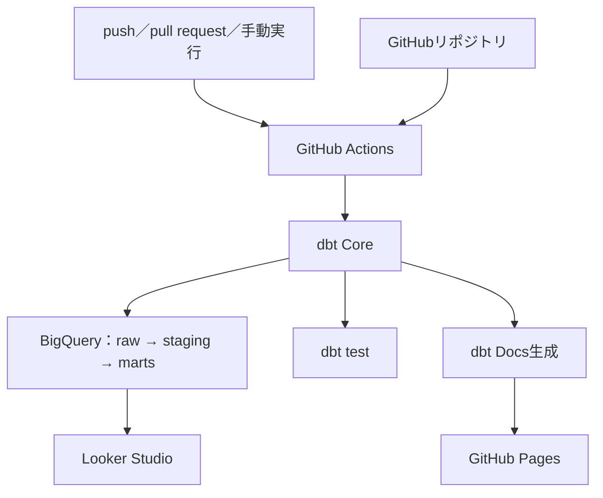

# 実装設計

関連資料：[要件・受入基準](requirements-and-acceptance.md)

## 1. 目的

合成CSVから照合結果とエラー明細を作成し、品質を検証して可視化・ドキュメント公開するまでの実装方式を示す。

業務要件、12種類のエラー定義、受入基準は[要件・受入基準](requirements-and-acceptance.md)を正本とし、本書では重複して定義しない。

## 2. システム構成



GitHub Actionsはリポジトリを取得し、Workload Identity FederationでGoogle Cloudへ認証してdbtを実行する。いずれかの検証処理が失敗した場合、ワークフロー全体を失敗とする。`main`へのpush時のみ、生成したdbt DocsをGitHub Pagesへ公開する。

READMEの[概要データフロー](../README.md#概要データフロー)は閲覧者向けにデータの流れだけを示し、本図はCIとドキュメント公開を含む実装構成を示す。

## 3. データ処理

1. `dbt seed --full-refresh`で4種類の合成CSVをBigQueryのrawへ投入する。
2. stagingビューで項目名とデータ型を整える。
3. 注文を母集団として、成功した決済、加盟店、精算を結合する。
4. `fct_payment_reconciliation`で注文単位の異常フラグと総合状態を算出する。
5. `fct_reconciliation_errors`で異常フラグをエラー種別ごとの行へ変換する。
6. Looker Studioがmartsを参照して照合サマリとエラー明細を表示する。

## 4. データモデル

| レイヤー | モデル | 形式 | 役割 |
|---|---|---|---|
| raw | `merchants`、`orders`、`payments`、`settlements` | seedテーブル | 合成入力データ |
| staging | `stg_merchants`、`stg_orders`、`stg_payments`、`stg_settlements` | view | 型・名称の統一 |
| marts | `fct_payment_reconciliation` | view | 1注文1行の照合結果 |
| marts | `fct_reconciliation_errors` | view | 1注文・1エラー種別につき1行の明細 |

処理規模が小さく、独立して再利用する中間処理もないため、intermediate層は設けない。モデル依存関係、全カラム、データ型、テストは[dbt Docs](https://naohide-sugita.github.io/payment-reconciliation-data-mart/)を正本とする。

## 5. 結合方式

注文を基準にLEFT JOINすることで、関連データが存在しない注文も照合対象に残す。

| 結合先 | 結合条件 | 補足 |
|---|---|---|
| 決済 | `order_id` | 成功した決済を対象とする |
| 加盟店 | `merchant_id` | 注文の加盟店を参照する |
| 精算 | `settlement_batch_id` | 決済に対応する精算を参照する |

注文に紐づかない決済や精算の検出は対象外とする。

## 6. 異常判定と可視化

12種類の異常フラグはそれぞれ独立して算出する。`error_count`はフラグの合計とし、0件なら`MATCHED`、1件以上なら`ERROR`とする。正式な4分類、フラグ名、判定条件は[照合・異常判定要件](requirements-and-acceptance.md#6-照合異常判定要件)を参照する。

`fct_reconciliation_errors`は、異常があるフラグだけを`order_id`、`error_code`、`error_reason`の行へ変換する。正常な注文は出力せず、複数の異常がある注文は複数行を出力する。

Looker Studioの照合サマリでは、[`looker_studio_error_type_summary.sql`](../payment_reconciliation/analyses/looker_studio_error_type_summary.sql)に定義した4分類と表示順を使用する。12種類をマスタ相当の行として先に定義し、実績をLEFT JOINすることで0件のエラーも表示する。

## 7. テスト設計

YAMLの汎用テストでは主キー、必須項目、許容値、参照整合性を検証する。独自SQLテストでは、次を検証する。

- 照合結果が1注文1行であること
- 12種類の異常フラグにNULLがないこと
- `error_count`が異常フラグの合計と一致すること
- `reconciliation_status`が`error_count`と一致すること
- 合成データの期待結果と実際の照合結果が一致すること
- エラー明細が注文単位の異常フラグと対応すること

テスト定義と各モデルへの対応は[dbt Docs](https://naohide-sugita.github.io/payment-reconciliation-data-mart/)で確認する。

## 8. 実行と継続的検証

### 8.1 ローカル実行

```powershell
cd payment_reconciliation
dbt debug
dbt seed --full-refresh
dbt run --full-refresh
dbt test
dbt docs generate
dbt docs serve
```

### 8.2 GitHub Actions

`.github/workflows/dbt-ci.yml`は、`main`へのpush、`main`向けpull request、手動実行で起動する。パスフィルタにより、dbtプロジェクト、依存関係、ワークフローの変更を対象とする。

```text
dbt debug
    ↓
dbt seed --full-refresh
    ↓
dbt run --full-refresh
    ↓
dbt test
    ↓
dbt docs generate
```

pull requestでは生成までを検証する。`main`へのpush時は生成物をPages artifactとしてアップロードし、後続ジョブでGitHub Pagesへ公開する。

GitHub Pagesの公開元は、リポジトリのSettings → Pagesで「GitHub Actions」を選択する。公開URLは次のとおり。

<https://naohide-sugita.github.io/payment-reconciliation-data-mart/>

## 9. 認証・公開安全性

- Google Cloud認証には長期秘密鍵ではなくWorkload Identity Federationを使用する。
- プロジェクトID、プロバイダ、サービスアカウントはGitHub ActionsのVariablesから参照する。
- GitHub Pagesへ公開する`target`には、モデル定義、依存関係、カラム説明、テスト情報が含まれる。
- 認証情報、個人情報、実在取引データをリポジトリおよび公開物へ含めない。

対象範囲と対象外は[要件・受入基準](requirements-and-acceptance.md#3-対象範囲)を参照する。
