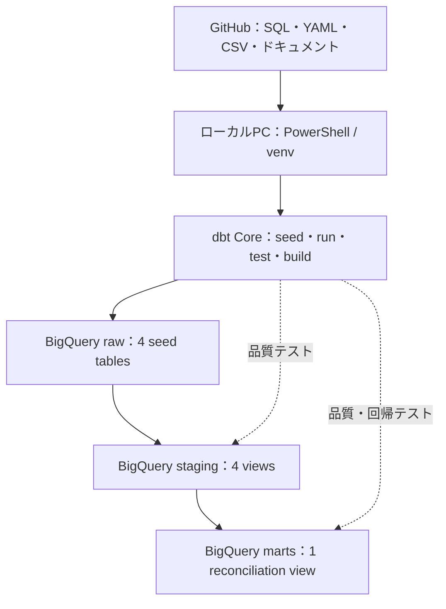
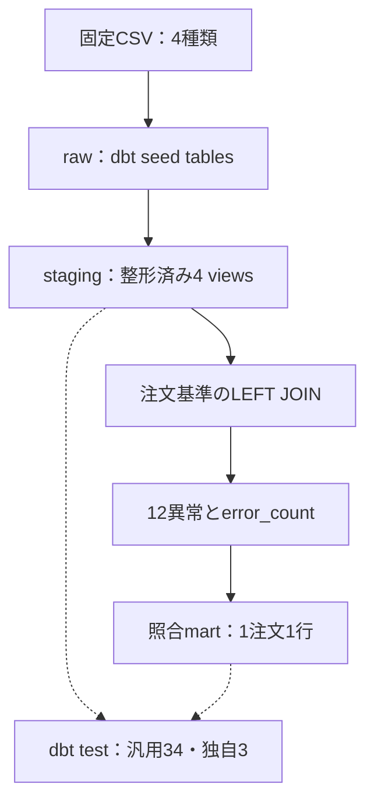
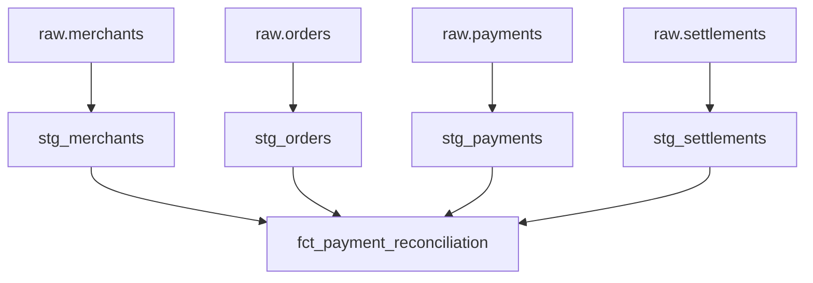

# 実装設計

- 版：v0.3
- 更新日：2026-08-04
- 対象：MVP v0.1.0／応募用仕上げ v0.2.0
- 関連資料：[要件・受入基準](requirements-and-acceptance.md)

## 1. 目的

固定の疑似CSVから、注文・決済・加盟店・精算を注文単位で照合するまでの実装構成を示す。
本書では、現在実装済みのデータフロー、モデル依存、結合、異常判定、テスト配置を扱う。

## 2. 現在のシステム構成



| 構成要素 | 現在の役割 | 採用理由 |
|---|---|---|
| GitHub | コード、固定CSV、設計資料、変更履歴の管理 | 公開成果物と実装を同じ履歴で確認できる |
| ローカルPC | dbtコマンドの実行 | MVPでは最小構成で変換・テストを再現できる |
| dbt Core | seed投入、SQL変換、依存関係、テストの実行 | 変換ロジックと品質検証をSQL・YAMLで管理できる |
| BigQuery | raw、staging、martsの保持とSQL実行 | サーバー管理が不要で、データレイヤーを分離できる |

GitHub Actionsは次期開発で追加する回帰テスト基盤であり、MVP v0.1.0時点では構成に含めない。

## 3. データフロー



| ID | 処理 | 入力 | 主な処理 | 出力 |
|---|---|---|---|---|
| DF-01 | raw投入 | 固定CSV 4種類 | `dbt seed --full-refresh`で全件再作成 | raw 4テーブル |
| DF-02 | staging整形 | raw 4テーブル | 文字列整形、型変換、状態値の大文字化、空文字のNULL化 | staging 4ビュー |
| DF-03 | 照合対象作成 | staging 4ビュー | 注文を母集団に、成功決済・加盟店・精算をLEFT JOIN | 結合済み注文データ |
| DF-04 | 計算値作成 | 結合済み注文データ | 期待手数料・期待入金額を算出 | 計算値付きデータ |
| DF-05 | 異常判定 | 計算値付きデータ | 12種類の異常フラグを独立して算出 | 異常フラグ付きデータ |
| DF-06 | 総合判定 | 異常フラグ付きデータ | フラグ合計を`error_count`とし、状態を判定 | `fct_payment_reconciliation` |
| DF-07 | 品質検証 | staging・mart | 汎用テストと独自SQLテストを実行 | 合否結果 |

## 4. データレイヤーとモデル

| レイヤー | オブジェクト | 形式 | 粒度・役割 |
|---|---|---|---|
| raw | `merchants` | seed table | 1加盟店。加盟店名と手数料率の入力 |
| raw | `orders` | seed table | 1注文。照合の母集団 |
| raw | `payments` | seed table | 1決済。注文との対応、決済状態、精算バッチを保持 |
| raw | `settlements` | seed table | 1精算。精算金額、加盟店、状態、日時を保持 |
| staging | `stg_merchants` | view | ID・名称のtrim、手数料率をNUMERICへ変換 |
| staging | `stg_orders` | view | IDのtrim、注文金額をINT64、注文日時をTIMESTAMPへ変換 |
| staging | `stg_payments` | view | IDのtrim、金額・日時の型変換、状態値の大文字化、空の精算バッチIDをNULL化 |
| staging | `stg_settlements` | view | IDのtrim、各金額・日時の型変換、状態値の大文字化 |
| marts | `fct_payment_reconciliation` | view | 1注文1行。照合結果、計算値、12異常フラグ、総合状態を保持 |

中間層は設けていない。現行は4つのstagingモデルと1つのmartであり、独立した再利用処理がないため、層を増やすよりmart内のCTEで処理段階を明示する方が簡潔である。

## 5. モデル依存関係



staging以降のモデル依存関係はdbtの`ref()`で管理する。rawはseedと同名のsourceとして参照しているため、dbt上でseedからstagingへの依存関係は作られない。初回構築ではseedを先に明示実行する。

## 6. 照合モデルの内部設計

`fct_payment_reconciliation.sql`は、処理段階を5つのCTEに分ける。

| CTE | 役割 |
|---|---|
| `orders` | 注文を照合の母集団として取得 |
| `successful_payments` | `payment_status = 'SUCCESS'`の決済だけを抽出 |
| `joined_data` | 注文を起点に決済、加盟店、精算を結合し、期待手数料・期待入金額を計算 |
| `error_flags` | 結合結果から12種類の異常フラグを算出 |
| `error_summary` | 12フラグを合計し、`error_count`を算出 |

最終SELECTで、`error_count > 0`なら`ERROR`、それ以外は`MATCHED`とする。

## 7. 結合設計

| 結合先 | 結合キー | 結合方式 | 理由 |
|---|---|---|---|
| 成功決済 | `orders.order_id = successful_payments.order_id` | LEFT JOIN | 決済がない注文も母集団から落とさず、異常として検出する |
| 加盟店マスタ | `orders.merchant_id = merchants.merchant_id` | LEFT JOIN | マスタ未登録を異常として検出する |
| 精算 | `payments.settlement_batch_id = settlements.settlement_batch_id` | LEFT JOIN | 精算未到着を異常として検出する |

注文を母集団とするため、注文に紐づかない決済・精算を検出する設計ではない。これはMVPの対象外である。

## 8. 異常判定

| ID | 出力フラグ | 判定概要 |
|---|---|---|
| REC-01 | `is_payment_missing` | 成功決済がない |
| REC-02 | `is_merchant_missing` | 加盟店マスタがない |
| REC-03 | `is_fee_rate_missing` | 加盟店はあるが手数料率がない |
| REC-04 | `is_order_payment_amount_mismatch` | 注文金額と決済金額が不一致 |
| REC-05 | `is_settlement_missing` | 決済はあるが精算がない |
| REC-06 | `is_settlement_not_completed` | 精算状態が`COMPLETED`でない |
| REC-07 | `is_merchant_mismatch` | 注文加盟店と精算加盟店が不一致 |
| REC-08 | `is_gross_amount_mismatch` | 決済金額と精算総額が不一致 |
| REC-09 | `is_fee_amount_mismatch` | 実手数料と期待手数料が不一致 |
| REC-10 | `is_net_amount_mismatch` | 実入金額と期待入金額が不一致 |
| REC-11 | `is_payment_datetime_invalid` | 必要日時がない、または決済日時が注文日時より前 |
| REC-12 | `is_settlement_datetime_invalid` | 必要日時がない、または精算日時が決済日時より前 |

異常フラグは排他的ではない。1注文に複数異常がある場合はすべて保持する。意図した業務異常を正しく出力できた場合、dbt実行は成功とする。

## 9. テスト方針と配置

| 区分 | 配置 | 主な確認 | MVP実績 |
|---|---|---|---:|
| source定義 | `models/staging/sources.yml` | raw 4テーブルをdbt sourceとして参照 | 4 sources |
| staging汎用テスト | `models/staging/schema.yml` | 主キー、必須値、許容値、参照整合性 | 汎用テストに含む |
| mart汎用テスト | `models/marts/schema.yml` | 注文IDの一意性・NULL、状態値、12フラグと件数のNULL | 汎用テストに含む |
| 独自SQLテスト | `tests/` | フラグ合計、固定8注文の期待結果、状態整合性 | 3件 |

汎用34件と独自SQL 3件の合計37件を`dbt test`で検証する。全件再構築では4 seeds、5 models、37 testsの合計46件を`seed → run → test`の順で実行する。

## 10. 実行と再実行

```powershell
cd payment_reconciliation
dbt seed --full-refresh
dbt run --full-refresh
dbt test
```

`dbt build --full-refresh`単独では、既存のrawテーブルを参照してstagingがseedより先に実行される場合がある。このため、初回構築と再実行では上記3コマンドの順序を明示する。

現行の再実行は、同じ固定CSVからraw、staging、martを全件再構築する方式である。増分更新、遅延到着、継続取込に対する冪等性を示すものではない。

## 11. ディレクトリ構成

```text
payment-reconciliation-data-mart/
├── README.md
├── docs/
│   ├── requirements-and-acceptance.md
│   └── implementation-design.md
└── payment_reconciliation/
    ├── dbt_project.yml
    ├── models/
    │   ├── staging/
    │   │   ├── sources.yml
    │   │   ├── schema.yml
    │   │   ├── stg_merchants.sql
    │   │   ├── stg_orders.sql
    │   │   ├── stg_payments.sql
    │   │   └── stg_settlements.sql
    │   └── marts/
    │       ├── schema.yml
    │       └── fct_payment_reconciliation.sql
    ├── seeds/
    │   ├── merchants.csv
    │   ├── orders.csv
    │   ├── payments.csv
    │   └── settlements.csv
    └── tests/
```

## 12. 設計判断

| 判断 | 理由 |
|---|---|
| 注文を母集団にする | 注文に対する決済・精算の欠落を残したまま検出できる |
| 成功決済だけを照合する | 失敗決済を精算対象として扱わない |
| LEFT JOINを使用する | 関連データ欠落を行の消失ではなく異常フラグとして表す |
| stagingとmartをviewにする | 固定・少量データのMVPでは保存コストと更新制御を増やす必要がない |
| 異常を12個のbooleanで保持する | 複数原因を同時に残し、件数と理由を機械的に確認できる |
| 中間層を設けない | 5モデル規模では再利用性より構成の単純さを優先する |
| 全件再構築を採用する | 固定seedの回帰テストが目的で、増分取込は対象外だから |

## 13. CI回帰テスト設計

P-05では、固定seedを回帰テストケースとして使用するGitHub Actionsの実行方針を次のとおり決定する。ワークフローとGCP認証はP-06～P-08で実装・検証するため、本書v0.3の時点では設計済み・未実装である。

### 13.1 目的

SQL、YAML、seedを変更した際に、注文・決済・精算の照合ロジックとデータ品質が既知の期待結果から退行していないことを自動確認する。本CIは本番バッチや日次データ処理ではなく、固定テストデータを用いた継続的な回帰テストである。

### 13.2 実行契機

| 契機 | 対象 | 方針 |
|---|---|---|
| `push` | `main`ブランチ | dbt関連ファイルの反映後に回帰テストを実行する |
| `pull_request` | `main`ブランチ向け | 同一リポジトリ内のブランチからのPRだけ、GCP認証を伴う回帰テストを実行する |
| `workflow_dispatch` | 手動 | 認証・設定変更後や再確認時に任意実行できるようにする |

`payment_reconciliation/**`、CI依存関係ファイル、ワークフロー自身の変更を起動対象とし、ドキュメントだけの変更ではBigQueryを実行しない。外部forkからのPRにはGCP権限を渡さない。

### 13.3 実行環境と制御

| 項目 | 決定内容 |
|---|---|
| runner | GitHub-hosted Ubuntu runner |
| Python | CI設定で固定したバージョン |
| dbt | ローカルで動作確認済みの`dbt-bigquery`系バージョンを固定 |
| 作業ディレクトリ | `payment_reconciliation/` |
| BigQuery location | `asia-northeast1` |
| 認証 | GitHub OIDCとGoogle Cloud Workload Identity Federationを使用し、サービスアカウント鍵は保存しない |
| 権限 | 対象プロジェクトでdbt実行に必要なBigQuery権限だけを付与する |
| 同時実行 | `concurrency`でdbt CIを1本に制限し、同一テーブルへの競合を防ぐ |
| 秘密情報 | プロジェクトID等はGitHub Variables、認証先識別子はSecretsまたはVariablesで管理し、JSON鍵は使用しない |

### 13.4 実行順序

raw seedがdbtの依存グラフに接続されていないため、`dbt build`単独は使用しない。次の順序を別ステップとして固定し、いずれかが失敗した時点で後続処理を停止する。

```text
checkout
  → Python・dbt-bigqueryの準備
  → GitHub OIDCによるGCP認証
  → profiles.ymlのCI設定を生成
  → dbt debug
  → dbt seed --full-refresh
  → dbt run --full-refresh
  → dbt test
```

### 13.5 成功・失敗条件

| 区分 | 条件 |
|---|---|
| 成功 | `dbt debug`が成功し、seed 4件、model 5件、test 37件がすべて成功する |
| 失敗 | 認証・接続・コンパイル・seed・model・testのいずれかが非ゼロ終了する |
| 業務異常 | サンプル注文が`ERROR`と判定されても、固定ケースの期待値と一致すればCI成功とする |
| 退行 | 正常注文の誤判定、異常の見逃し、重複、NULL、許容値違反、固定8注文の期待結果不一致はdbt test失敗とする |

### 13.6 P-05完了条件

- 実行契機と対象パスが決定している
- 外部forkのPRにGCP権限を渡さない方針が決定している
- `seed → run → test`の実行順序が決定している
- 4 seed、5 model、37 testを成功条件としている
- 固定データ内の業務異常とCI失敗の違いを説明できる
- 認証方式を鍵ファイルではなくWorkload Identity Federationに決定している

## 14. 現在の対象外と次期開発

- GCS・APIからの継続取込
- 日次スケジュール実行
- 増分更新・遅延到着対応
- 取込履歴・バッチ監視・障害通知
- intermediate層
- 本番規模の性能・可用性設計

P-06～P-08では、上記方針に従ってGitHub Actions用GCP認証、ワークフロー、正常系・意図的失敗の確認を実装する。

## 15. P-03完了条件

- raw、staging、martsの現在構成が実装と一致している
- 5モデルの依存関係と3つの結合を説明できる
- 12種類の異常判定と`error_count`、総合状態の関係を説明できる
- 汎用テストと独自SQLテストの役割・配置を説明できる
- 未実装のGCS、増分更新、GitHub Actionsを実装済みとして記載していない
